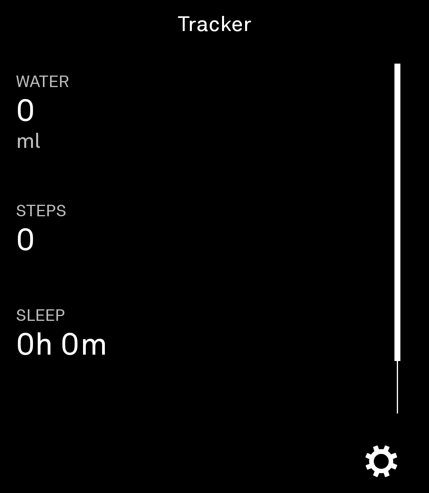
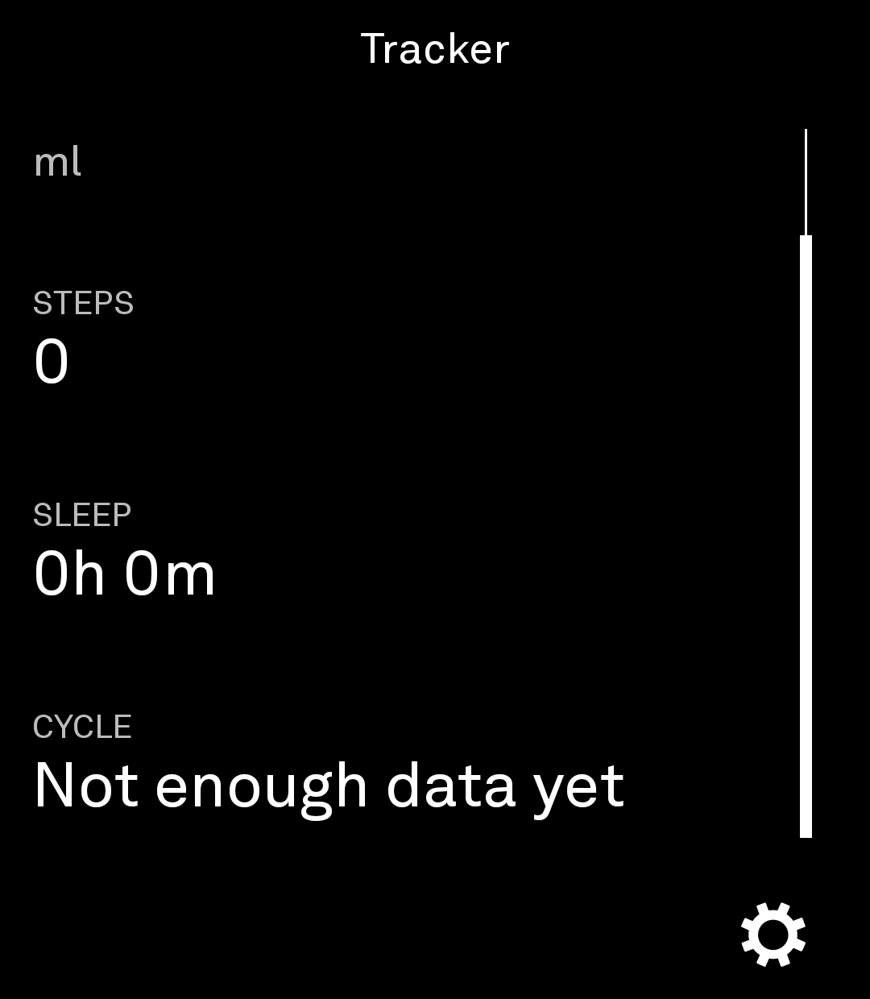
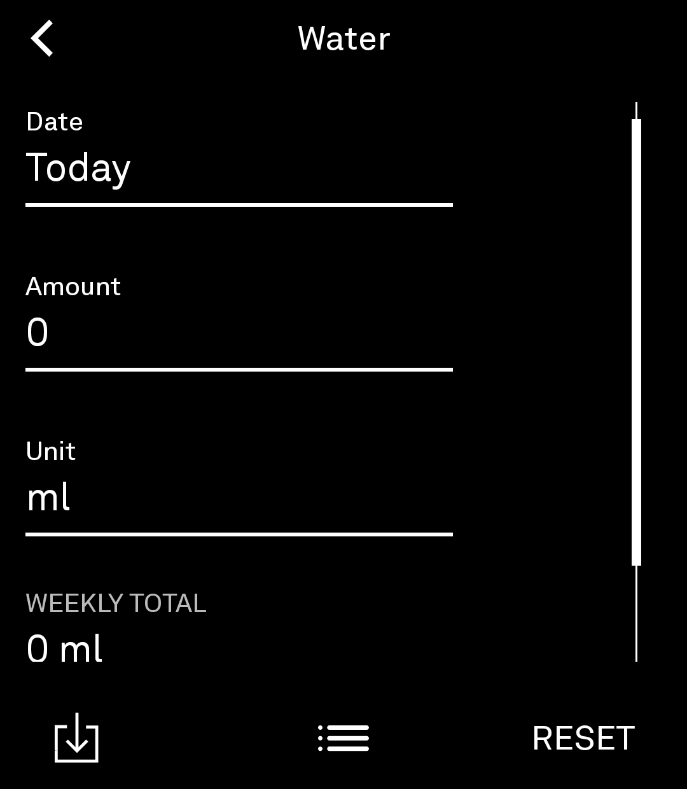
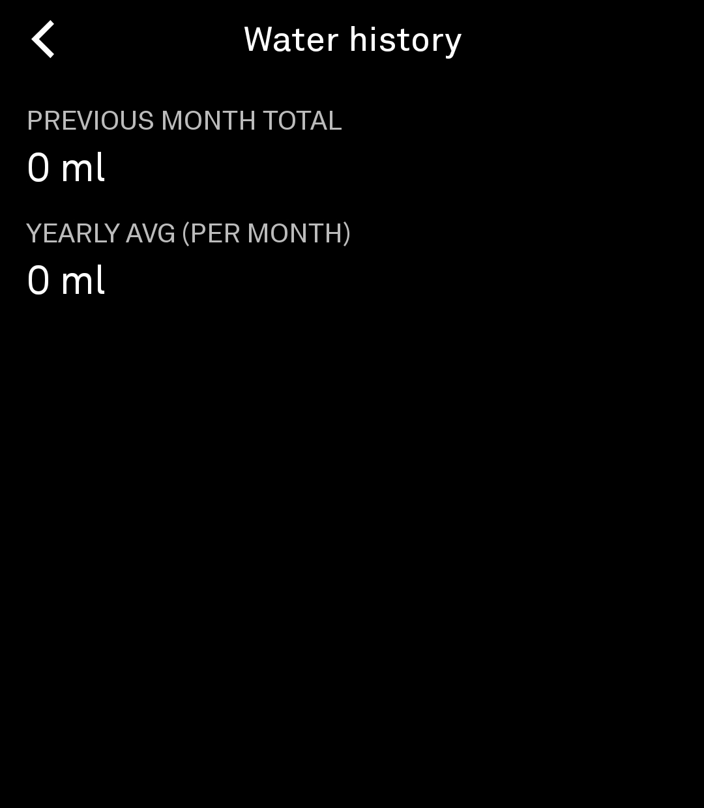
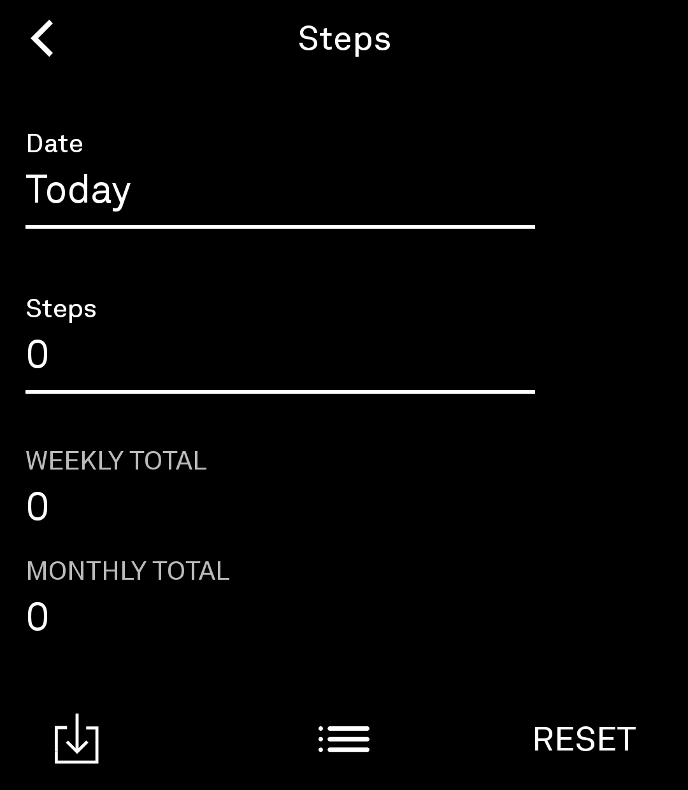
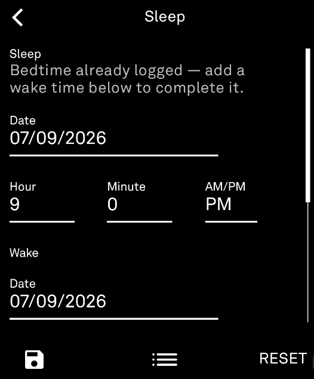
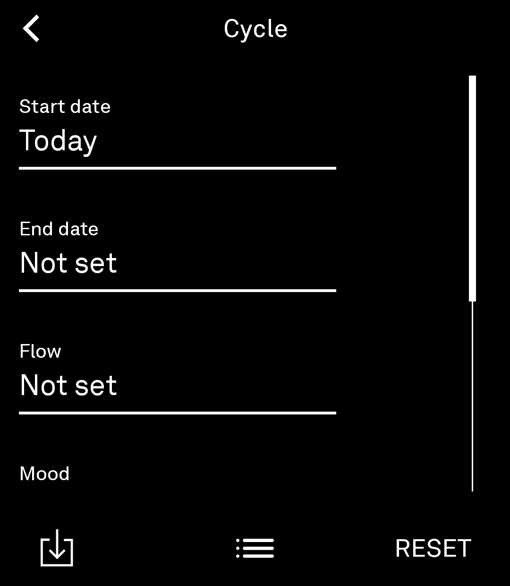
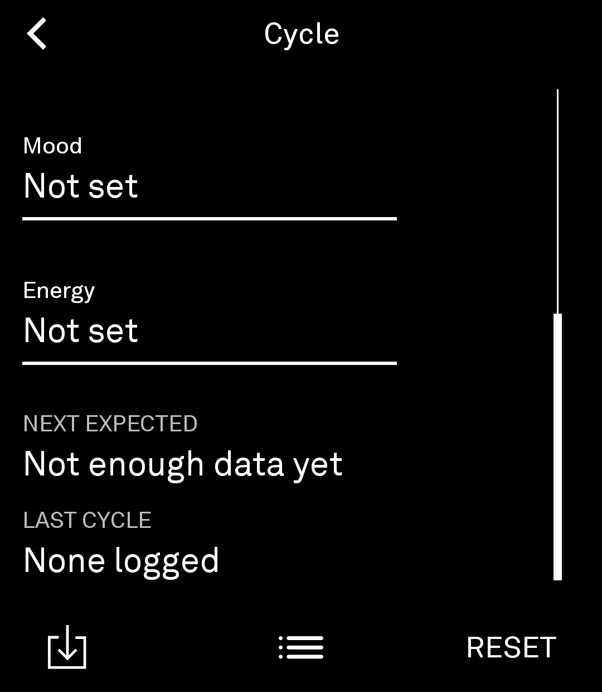
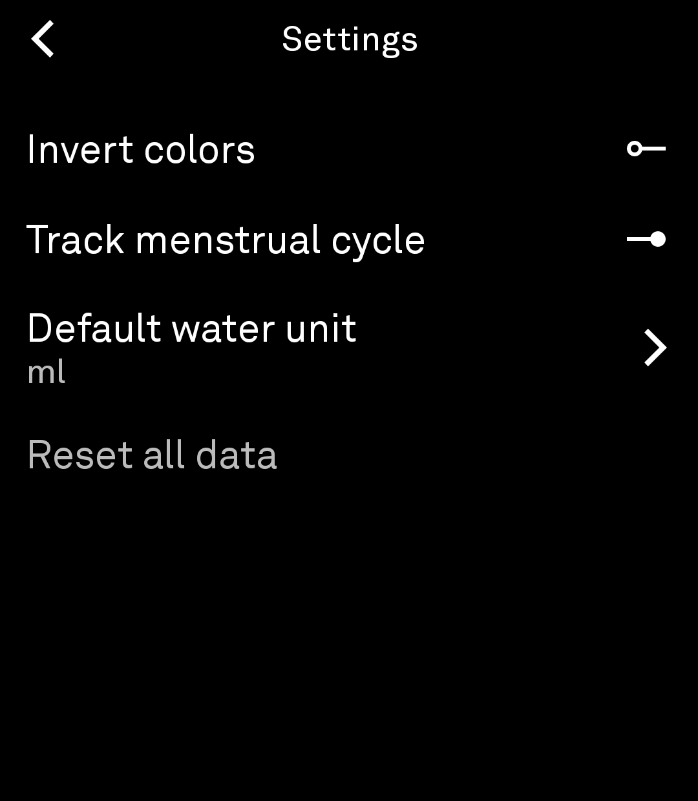

# Tracker

A tiny health tracker for the Light Phone III — just a simple way to keep tabs on your water intake, sleep, steps, and (if it applies to you) your cycle, without any distractions.

This repo is built on Light's SDK scaffolding for Light Phone III tools, but at this point it's really just the Tracker app. The actual app code lives in [`tool/`](./tool) — see [`tool/README.md`](./tool/README.md) for the same rundown below, plus anything that's app-specific. SDK-level documentation (for anyone building their own separate tool on this scaffolding) is still in [`docs/`](./docs).

## What it does

- **Water** — log how much you're drinking today, in whatever unit you prefer
- **Sleep** — log the exact date and time you fell asleep, and the date and time you woke up (e.g. sleep 07/07/26 11:30 PM, wake 07/08/26 7:00 AM) — it works out the hours for you
- **Steps** — track your daily step count
- **Cycle** *(optional)* — log period start/end dates, flow, mood, and energy, and see your next expected date on the home screen. Off by default — flip it on in Settings if it's useful to you
- **Weight** *(optional)* — log a starting weight and keep logging your current weight over time; shows your average change per week as one neutral number (no separate "loss" or "gain" framing). Off by default, same as Cycle
- **Mood** *(optional)* — log how you're feeling (pick up to 5 from a categorized list) plus a short note, backdateable like everything else. Off by default. If you've already logged something for a given day, reopening it shows what you logged instead of a blank form. If you also track Cycle, Cycle's own mood field automatically links here instead of asking you to log twice
- **Forgot to log something?** Every entry screen lets you pick a date from a calendar, so you can backdate an entry instead of losing that day
- **History** — Water, Steps, and Sleep each have a history view showing last month's total and a yearly average; Cycle, Weight, and Mood each have their own history of past entries, with the option to delete any entry you didn't mean to log
- **Settings** — flip to a light theme if you'd rather not stare at black-on-white all day (or vice versa), choose AM/PM or 24-hour time (used for Sleep), set your default water unit, turn Cycle, Weight, or Mood tracking on/off, or reset your data

## Using it

Install the APK on your Light Phone III.

## Screenshots

<table>
<tr>
<td> Home</td>
<td> Home (Cycle enabled)</td>
<td> Water</td>
</tr>
<tr>
<td> Water history</td>
<td> Steps</td>
<td> Sleep</td>
</tr>
<tr>
<td> Cycle</td>
<td> Cycle (scrolled)</td>
<td> Settings</td>
</tr>
</table>
