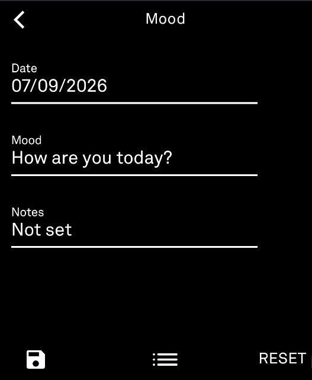

# Tracker

A tiny health tracker for the Light Phone III — just a simple way to keep tabs on your water intake, sleep, steps, and (if it applies to you) your cycle, without any distractions.

## What it does

- **Water** — log how much you're drinking today, in whatever unit you prefer
- **Sleep** — log the exact date and time you fell asleep, and the date and time you woke up (e.g. sleep 07/07/26 11:30 PM, wake 07/08/26 7:00 AM) — it works out the hours for you. You can log bedtime and wake time separately too — save just the time you went to bed, then come back later (even the next morning) to add when you woke up
- **Movement** — track however you actually move: Steps, Laps, Distance, or Time, independently of each other, each with its own weekly and monthly totals. Pick which one shows on the Home screen, and turn off any categories you don't use
- **Cycle** *(optional)* — log period start/end dates, and log Flow, Energy, and Mood for each individual day of the cycle (since flow especially tends to vary day to day), plus see your next expected date on the home screen. Off by default — flip it on in Settings if it's useful to you
- **Weight** *(optional)* — log a starting weight and keep logging your current weight over time; shows your average change per week as one neutral number (no separate "loss" or "gain" framing). Off by default, same as Cycle
- **Mood** *(optional)* — log how you're feeling (pick up to 5 from a categorized list) plus a short note, backdateable like everything else. Off by default. The form clears after each save, so logging a second, different mood later the same day is just as easy as the first. If you also track Cycle, Cycle's own mood field automatically links here instead of asking you to log twice
- **Notes** *(optional)* — a standalone, freeform place for anything that doesn't fit the app's other trackers, up to 370 characters per entry, multiple entries per day allowed. Off by default. The Home tile only ever shows when your last entry was, not what it says, so a glance at your screen doesn't reveal its contents
- **Forgot to log something?** Every entry screen lets you pick a date from a calendar, so you can backdate an entry instead of losing that day
- **History** — Water, Movement, and Sleep each have a history view showing last month's total and a yearly average; Cycle, Weight, Mood, and Notes each have their own history of past entries, with the option to delete any entry you didn't mean to log
- **Settings** — flip to a light theme if you'd rather not stare at black-on-white all day (or vice versa), turn any of Water, Movement (with its own Movement Type submenu for Steps/Laps/Distance/Time), Sleep, Cycle, Weight, Mood, or Notes tracking on or off, or reset your data. Under **Units & Formats**: your default water unit, default distance unit, default date format (mm/dd/yyyy, dd/mm/yyyy, or yyyy/mm/dd — used everywhere a date shows up), and default time format (AM/PM or 24-hour, used for Sleep)

## Using it

Install the APK on your Light Phone III.

## Screenshots

<table>
<tr>
<td> Home</td>
<td> Home (Cycle enabled)</td>
<td> Water</td>
</tr>
<tr>
<td> Water history</td>
<td> Mood</td>
<td> Sleep</td>
</tr>
<tr>
<td> Cycle</td>
<td> Cycle (scrolled)</td>
<td> Settings</td>
</tr>
</table>
